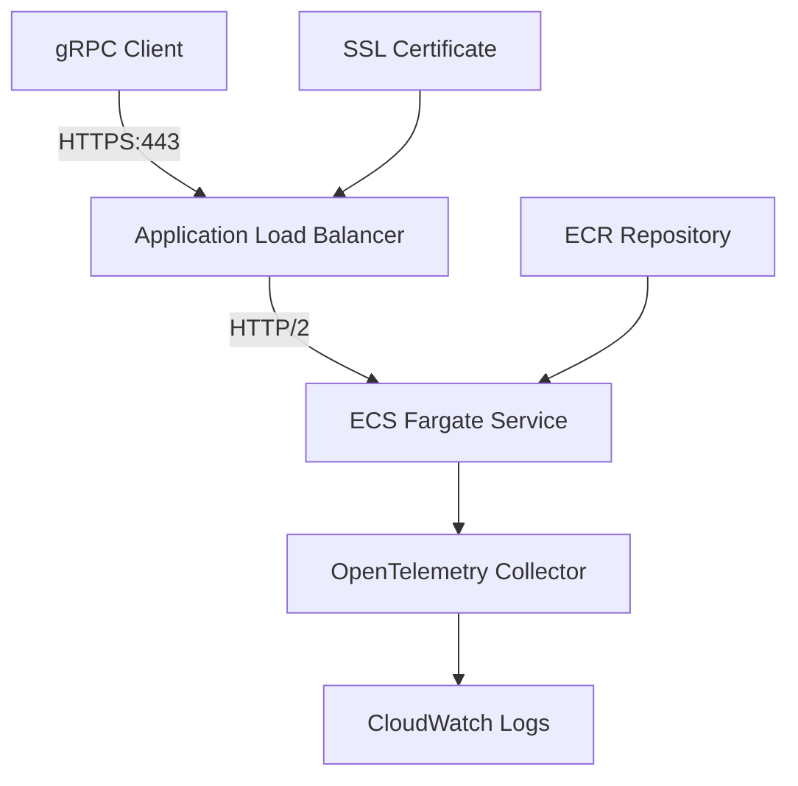

# 🔐 Secure OpenTelemetry gRPC Collector

[](https://opensource.org/licenses/MIT)
[](https://www.terraform.io/)
[](https://aws.amazon.com/)

Production-ready OpenTelemetry Collector with **HTTPS gRPC**, **HTTP/2**, and **CloudWatch** integration. Deploy to AWS in 5 minutes with your SSL certificate.

## ✨ Features

🔐 **Enterprise Security** - HTTPS/TLS + HTTP/2 + VPC isolation  
⚡ **Production Ready** - ECS Fargate + ALB + Auto-scaling  
🚀 **Single Command Deploy** - `terraform apply` and you're live  
💰 **FREE SSL Certificates** - AWS Certificate Manager included  

## 🏗️ Architecture



**Your secure endpoint:** `https://your-alb-dns:443`

## 🚀 Quick Start

### 1. Get SSL Certificate ARN
```bash
aws acm list-certificates --region us-east-1
# Copy your certificate ARN
```

### 2. Deploy Everything
```bash
git clone <repo-url>
cd Launch-OpenTelemetry-LogTarget-Cloudwatch-connector

# Setup AWS credentials
cp aws-credentials.example aws-env.sh
# Edit aws-env.sh with your credentials
source aws-env.sh

# Configure Terraform
cp terraform.tfvars.example terraform/terraform.tfvars
# Edit terraform/terraform.tfvars with your certificate ARN

# Deploy infrastructure
cd terraform && terraform init && terraform apply

# Build and deploy container  
cd .. && ./build-and-push.sh
```

**🎉 Your secure gRPC endpoint is ready!**

## 📋 Configuration

### 🔐 **Required: JWT Bearer Token**
Get your JWT token from **Launch Console > Log Targets > Configuration**:
```bash
# Set as environment variable (recommended)
export LAUNCH_JWT_TOKEN="your-jwt-bearer-token-from-launch-console"

# Or update in otelcol-config.yaml:
token: "your-jwt-bearer-token-from-launch-console"
```

### 🏗️ **Required: Terraform Configuration**
**`terraform/terraform.tfvars`:**
```hcl
ssl_certificate_arn = "arn:aws:acm:us-east-1:123456789012:certificate/your-cert"
aws_region = "us-east-1"
```

**Optional customizations:**
```hcl
environment = "prod"
app_count = 2          # Number of tasks
fargate_cpu = 512      # 0.5 vCPU
fargate_memory = 1024  # 1GB RAM
```

## 💰 Monthly Cost

| Service | Cost | Notes |
|---------|------|-------|
| **SSL Certificate (ACM)** | **$0.00** | ✅ **FREE** |
| Application Load Balancer | ~$16 | 24/7 availability |
| ECS Fargate (1 task) | ~$14 | 0.25 vCPU, 512MB |
| NAT Gateway (2 AZs) | ~$65 | High availability |
| CloudWatch Logs | ~$1 | Minimal logging |
| **Total** | **~$96/month** |

💡 **Single AZ deployment:** Save ~$32/month for dev/test

## 🧪 Testing Your Deployment

### 🎯 Quick Test with Automated Script

Use the included test script to verify your secure gRPC endpoint:

```bash
# Set your JWT token from Launch Log Target settings
export LAUNCH_JWT_TOKEN="your-jwt-token-from-launch-console"

# Test your deployed OpenTelemetry collector
./test-grpc-logs.sh
```

**What it does:**
- ✅ Connects securely via HTTPS/HTTP2 with proper SNI
- ✅ Authenticates using Bearer token (from Launch Log Target settings)
- ✅ Sends valid OpenTelemetry logs in OTLP format
- ✅ Verifies logs reach CloudWatch (/ecs/otel log group)
- ✅ Provides troubleshooting steps if anything fails

**🔐 JWT Token Required:** The script will guide you to get your JWT token from:
**Launch Console > Log Targets > Your Target > Configuration > Bearer Token**

### 📊 Verify Logs in CloudWatch

```bash
# Watch logs being exported to CloudWatch
aws logs tail /ecs/otel --follow

# Check specific log events
aws logs get-log-events \
  --log-group-name '/ecs/otel' \
  --log-stream-name 'tastecard/logs'
```

### 🔧 Manual gRPC Testing

```bash
# Get your secure endpoint URL
terraform output grpc_endpoint

# Test with grpcurl (requires proto files)
grpcurl -servername "your-domain.com" \
  -proto opentelemetry/proto/collector/logs/v1/logs_service.proto \
  -H "Authorization: Bearer YOUR_TOKEN" \
  your-alb-dns:443 \
  opentelemetry.proto.collector.logs.v1.LogsService/Export

# Monitor OpenTelemetry collector logs
aws logs tail /ecs/launch-log-target --follow
```

> 💡 **Pro Tip:** The `test-grpc-logs.sh` script handles all the complexity - proto files, authentication, proper JSON format, and verification steps!

## 📚 Documentation

- 🚀 **[Complete Setup Guide](SETUP.md)** - Step-by-step deployment
- 🔐 **[Certificate Setup](docs/CERTIFICATES.md)** - SSL certificate options
- 🛡️ **[Security Guide](SECURITY.md)** - Best practices & compliance

## 🔧 Development

```bash
# Local testing
./start-otel.sh

# Update deployed service
./build-and-push.sh
./update-service.sh

# Scale service
aws ecs update-service --cluster <cluster> --service <service> --desired-count 3
```

## 🔍 Troubleshooting

**ECS Tasks Not Starting?**
```bash
aws logs tail /ecs/launch-log-target --follow
aws ecs describe-services --cluster <cluster> --services <service>
```

**Health Checks Failing?**  
```bash
curl -v https://$(terraform output -raw alb_dns_name)/
aws elbv2 describe-target-health --target-group-arn <arn>
```

**More help:** [Complete troubleshooting guide](SETUP.md#troubleshooting)

## 🗑️ Cleanup

```bash
cd terraform && terraform destroy
```

## 🤝 Contributing

1. Fork the repository
2. Create feature branch  
3. Test thoroughly
4. Submit pull request

---

**🚀 Ready for production?** This handles thousands of requests/second with enterprise security. Perfect for microservices observability and centralized logging.